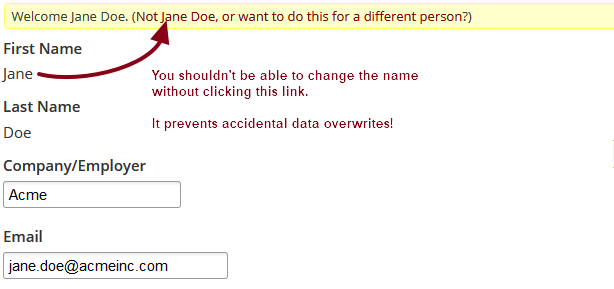

## CiviCRM noverwrite extension ##

Prevent users to overwrite on their record while trying to add a new participant/contrib

civiCRM by default pre-select your own contact details when you register to an event (or other public visible forms) if you are logged in. It is generally a good thing, but might lead to errors, for instance when a team member will overwrite their own contact record, or if one forward an invitation they received to someone else.
This extension put the first and last name fields read only, to prevent these mistakes
  
Based on an idea and initial code from Stoob. 

### Does it work with contacts not logged in but that use checksum? ###

yes

### Installation ###
Download/git clone in your extension folder, enable the extension. or directly from the extension list in your civicrm

